```mermaid
graph TD
    FW_1_TTR(["TTR"])
    L1_2_Out_of_Scope(["Out of Scope"])
    FW_1_TTR --> L1_2_Out_of_Scope
    L2_3_Out_of_Scope(["Out of Scope"])
    L1_2_Out_of_Scope --> L2_3_Out_of_Scope
    L3_4_Out_of_Scope["Out of Scope"]
    L2_3_Out_of_Scope --> L3_4_Out_of_Scope
    L3_5_No_Escalations_paths_exist["No Escalations paths exist"]
    L2_3_Out_of_Scope --> L3_5_No_Escalations_paths_exist
    L1_6_People_Gap(["People Gap"])
    FW_1_TTR --> L1_6_People_Gap
    L2_7_Delay_by_MSP_Managed_Service_P(["Delay by MSP (Managed Service Provider)"])
    L1_6_People_Gap --> L2_7_Delay_by_MSP_Managed_Service_P
    L3_8_Low_Capacity_Bandwidth_Shrinka["Low Capacity (Bandwidth Shrinkage)"]
    L2_7_Delay_by_MSP_Managed_Service_P --> L3_8_Low_Capacity_Bandwidth_Shrinka
    L3_9_Delay_in_case_assignment["Delay in case assignment"]
    L2_7_Delay_by_MSP_Managed_Service_P --> L3_9_Delay_in_case_assignment
    L2_10_In_Assign_Associate_Delay(["In Assign - Associate Delay"])
    L1_6_People_Gap --> L2_10_In_Assign_Associate_Delay
    L3_11_Lack_of_attention_by_the_assoc["Lack of attention by the associate"]
    L2_10_In_Assign_Associate_Delay --> L3_11_Lack_of_attention_by_the_assoc
    L3_12_Delay_in_raising_consult_to_SM["Delay in raising consult to SME"]
    L2_10_In_Assign_Associate_Delay --> L3_12_Delay_in_raising_consult_to_SM
    L3_13_Associate_didn_t_create_a_chil["Associate didn't create a child case within stipulated time"]
    L2_10_In_Assign_Associate_Delay --> L3_13_Associate_didn_t_create_a_chil
    L3_14_Associate_took_long_time_to_tr["Associate took long time to troubleshoot"]
    L2_10_In_Assign_Associate_Delay --> L3_14_Associate_took_long_time_to_tr
    L3_15_Wrong_case_state_selected_by_t["Wrong case state selected by the associate"]
    L2_10_In_Assign_Associate_Delay --> L3_15_Wrong_case_state_selected_by_t
    L3_16_Wrong_interpretation_of_seller["Wrong interpretation of seller query"]
    L2_10_In_Assign_Associate_Delay --> L3_16_Wrong_interpretation_of_seller
    L3_17_Delay_in_transferring_cases_to["Delay in transferring cases to the XFn team"]
    L2_10_In_Assign_Associate_Delay --> L3_17_Delay_in_transferring_cases_to
    L3_18_Weekend_Holiday_Controllable_e["Weekend/Holiday - Controllable error"]
    L2_10_In_Assign_Associate_Delay --> L3_18_Weekend_Holiday_Controllable_e
    L3_19_Unclear_scope["Unclear scope"]
    L2_10_In_Assign_Associate_Delay --> L3_19_Unclear_scope
    L2_20_Reopen_Associate_Error(["Reopen - Associate Error"])
    L1_6_People_Gap --> L2_20_Reopen_Associate_Error
    L3_21_Inaccurate_answer_provided_by_["Inaccurate answer provided by the associate"]
    L2_20_Reopen_Associate_Error --> L3_21_Inaccurate_answer_provided_by_
    L3_22_Incomplete_answer_provided_by_["Incomplete answer provided by the associate"]
    L2_20_Reopen_Associate_Error --> L3_22_Incomplete_answer_provided_by_
    L3_23_Response_sent_to_the_wrong_rec["Response sent to the wrong recipient"]
    L2_20_Reopen_Associate_Error --> L3_23_Response_sent_to_the_wrong_rec
    L3_24_Escalation_L1_Associate_Qualit["Escalation - L1 Associate Quality Error"]
    L2_20_Reopen_Associate_Error --> L3_24_Escalation_L1_Associate_Qualit
    L2_25_WOCA_WOCAP_Associate_Error(["WOCA/WOCAP - Associate Error"])
    L1_6_People_Gap --> L2_25_WOCA_WOCAP_Associate_Error
    L3_26_Insufficient_info_requested_by["Insufficient info requested by the associate"]
    L2_25_WOCA_WOCAP_Associate_Error --> L3_26_Insufficient_info_requested_by
    L3_27_Incorrect_info_requested_by_th["Incorrect info requested by the associate"]
    L2_25_WOCA_WOCAP_Associate_Error --> L3_27_Incorrect_info_requested_by_th
    L3_28_Incorrect_approvals_requested_["Incorrect approvals requested by the associate"]
    L2_25_WOCA_WOCAP_Associate_Error --> L3_28_Incorrect_approvals_requested_
    L1_29_Process_Gap(["Process Gap"])
    FW_1_TTR --> L1_29_Process_Gap
    L2_30_Backlogs(["Backlogs"])
    L1_29_Process_Gap --> L2_30_Backlogs
    L3_31_Backlog_due_to_PPH["Backlog due to PPH"]
    L2_30_Backlogs --> L3_31_Backlog_due_to_PPH
    L3_32_Backlog_due_to_PPR["Backlog due to PPR"]
    L2_30_Backlogs --> L3_32_Backlog_due_to_PPR
    L3_33_Weekend_Holiday_UnControllable["Weekend/Holiday - UnControllable"]
    L2_30_Backlogs --> L3_33_Weekend_Holiday_UnControllable
    L2_34_Case_arriving_late_to_the_queu(["Case arriving late to the queue"])
    L1_29_Process_Gap --> L2_34_Case_arriving_late_to_the_queu
    L3_35_Delay_in_transferring_cases_fr["Delay in transferring cases from XFn other teams"]
    L2_34_Case_arriving_late_to_the_queu --> L3_35_Delay_in_transferring_cases_fr
    L3_36_Incorrect_routing_due_to_compl["Incorrect routing due to complexity of the case"]
    L2_34_Case_arriving_late_to_the_queu --> L3_36_Incorrect_routing_due_to_compl
    L2_37_Consult_Delays(["Consult Delays"])
    L1_29_Process_Gap --> L2_37_Consult_Delays
    L3_38_Delay_in_raising_consult_from_["Delay in raising consult from SME to L2"]
    L2_37_Consult_Delays --> L3_38_Delay_in_raising_consult_from_
    L3_39_Delayed_consult_response_from_["Delayed consult response from L1.5(SME)"]
    L2_37_Consult_Delays --> L3_39_Delayed_consult_response_from_
    L3_40_Delayed_consult_response_from_["Delayed consult response from L2 (FTEs)"]
    L2_37_Consult_Delays --> L3_40_Delayed_consult_response_from_
    L3_41_Delayed_consult_response_from_["Delayed consult response from XFn Team"]
    L2_37_Consult_Delays --> L3_41_Delayed_consult_response_from_
    L3_42_Low_quality_consult_response_l["Low quality consult response leading to multiple iterations"]
    L2_37_Consult_Delays --> L3_42_Low_quality_consult_response_l
    L2_43_Documentation(["Documentation"])
    L1_29_Process_Gap --> L2_43_Documentation
    L3_44_Missing_Documentation["Missing Documentation"]
    L2_43_Documentation --> L3_44_Missing_Documentation
    L3_45_Low_Quality_Documentation["Low Quality Documentation"]
    L2_43_Documentation --> L3_45_Low_Quality_Documentation
    L2_46_High_Incoming_Volume(["High Incoming Volume"])
    L1_29_Process_Gap --> L2_46_High_Incoming_Volume
    L3_47_Delays_due_to_higher_incoming_["Delays due to higher incoming volumes than forecasted"]
    L2_46_High_Incoming_Volume --> L3_47_Delays_due_to_higher_incoming_
    L3_48_Delays_due_to_planned_volume_i["Delays due to planned volume increase"]
    L2_46_High_Incoming_Volume --> L3_48_Delays_due_to_planned_volume_i
    L2_49_Workflow_Complexities(["Workflow Complexities"])
    L1_29_Process_Gap --> L2_49_Workflow_Complexities
    L3_50_Approvals_Exceptions_Required["Approvals/Exceptions Required"]
    L2_49_Workflow_Complexities --> L3_50_Approvals_Exceptions_Required
    L3_51_Complex_Processes["Complex Processes"]
    L2_49_Workflow_Complexities --> L3_51_Complex_Processes
    L3_52_Bulk_Requests["Bulk Requests"]
    L2_49_Workflow_Complexities --> L3_52_Bulk_Requests
    L1_53_Product_Tools_Gap(["Product/Tools Gap"])
    FW_1_TTR --> L1_53_Product_Tools_Gap
    L2_54_Product_Bugs(["Product Bugs"])
    L1_53_Product_Tools_Gap --> L2_54_Product_Bugs
    L3_55_Automation_failure_resulting_i["Automation failure resulting in a delayed manual case"]
    L2_54_Product_Bugs --> L3_55_Automation_failure_resulting_i
    L3_56_Technical_issues_with_GCBP_ETM["Technical issues with GCBP (ETM, BACS, Roomba, Rainmaker etc)"]
    L2_54_Product_Bugs --> L3_56_Technical_issues_with_GCBP_ETM
    L3_57_Bugs_leading_to_delays["Bugs leading to delays"]
    L2_54_Product_Bugs --> L3_57_Bugs_leading_to_delays
    L2_58_Product_Complexity(["Product Complexity"])
    L1_53_Product_Tools_Gap --> L2_58_Product_Complexity
    L3_59_Latency_issue_need_time_to_ref["Latency issue (need time to reflect changes)"]
    L2_58_Product_Complexity --> L3_59_Latency_issue_need_time_to_ref
    L2_60_Product_Limitation(["Product Limitation"])
    L1_53_Product_Tools_Gap --> L2_60_Product_Limitation
    L3_61_Feature_is_not_Available_doesn["Feature is not Available/doesn't exist"]
    L2_60_Product_Limitation --> L3_61_Feature_is_not_Available_doesn
    L1_62_User_Gap(["User Gap"])
    FW_1_TTR --> L1_62_User_Gap
    L2_63_User_Gap_Delay_due_to_Submitte(["User Gap [Delay due to Submitter/Seller responses]"])
    L1_62_User_Gap --> L2_63_User_Gap_Delay_due_to_Submitte
    L3_64_WOCA["WOCA"]
    L2_63_User_Gap_Delay_due_to_Submitte --> L3_64_WOCA
    L3_65_WOCAP["WOCAP"]
    L2_63_User_Gap_Delay_due_to_Submitte --> L3_65_WOCAP
    L3_66_New_Follow_up_Questions["New/Follow up Questions"]
    L2_63_User_Gap_Delay_due_to_Submitte --> L3_66_New_Follow_up_Questions
    L3_67_Invalid_Reopens["Invalid Reopens"]
    L2_63_User_Gap_Delay_due_to_Submitte --> L3_67_Invalid_Reopens
    L3_68_User_provided_incomplete_inacc["User provided incomplete/inaccurate information"]
    L2_63_User_Gap_Delay_due_to_Submitte --> L3_68_User_provided_incomplete_inacc
    L3_69_User_disagrees_with_the_polici["User disagrees with the policies/processes/functionalities"]
    L2_63_User_Gap_Delay_due_to_Submitte --> L3_69_User_disagrees_with_the_polici
```

```mermaid
graph TD
    FW_1_Escalation(["Escalation"])
    L1_2_Invalid_Escalations(["Invalid Escalations"])
    FW_1_Escalation --> L1_2_Invalid_Escalations
    L2_3_Invalid_Escalations(["Invalid Escalations"])
    L1_2_Invalid_Escalations --> L2_3_Invalid_Escalations
    L3_4_Invalid_Requests["Invalid Requests"]
    L2_3_Invalid_Escalations --> L3_4_Invalid_Requests
    L3_5_Infeasible_Requests["Infeasible Requests"]
    L2_3_Invalid_Escalations --> L3_5_Infeasible_Requests
    L3_6_No_Action_required["No Action required"]
    L2_3_Invalid_Escalations --> L3_6_No_Action_required
    L1_7_Out_of_Scope(["Out of Scope"])
    FW_1_Escalation --> L1_7_Out_of_Scope
    L2_8_Out_of_Scope(["Out of Scope"])
    L1_7_Out_of_Scope --> L2_8_Out_of_Scope
    L3_9_Non_Data_Quality_Changes["Non Data Quality Changes"]
    L2_8_Out_of_Scope --> L3_9_Non_Data_Quality_Changes
    L3_10_No_Escalations_paths_exist["No Escalations paths exist"]
    L2_8_Out_of_Scope --> L3_10_No_Escalations_paths_exist
    L1_11_People_Gap(["People Gap"])
    FW_1_Escalation --> L1_11_People_Gap
    L2_12_Accuracy(["Accuracy"])
    L1_11_People_Gap --> L2_12_Accuracy
    L3_13_Identified_a_wrong_root_cause["Identified a wrong root cause"]
    L2_12_Accuracy --> L3_13_Identified_a_wrong_root_cause
    L3_14_Provided_an_inaccurate_solutio["Provided an inaccurate solution"]
    L2_12_Accuracy --> L3_14_Provided_an_inaccurate_solutio
    L2_15_Communication_Skills(["Communication Skills"])
    L1_11_People_Gap --> L2_15_Communication_Skills
    L3_16_Asked_for_information_repeated["Asked for information repeatedly or unnecessarily"]
    L2_15_Communication_Skills --> L3_16_Asked_for_information_repeated
    L3_17_Did_not_exude_ownership["Did not exude ownership"]
    L2_15_Communication_Skills --> L3_17_Did_not_exude_ownership
    L3_18_Did_not_respond_with_appropria["Did not respond with appropriate level of empathy"]
    L2_15_Communication_Skills --> L3_18_Did_not_respond_with_appropria
    L2_19_Completeness(["Completeness"])
    L1_11_People_Gap --> L2_19_Completeness
    L3_20_Did_not_answer_all_explicit_im["Did not answer all explicit / implicit questions or demonstrate comprehension of the issue"]
    L2_19_Completeness --> L3_20_Did_not_answer_all_explicit_im
    L3_21_Did_not_seek_confirmation_if_a["Did not seek confirmation if all questions were resolved"]
    L2_19_Completeness --> L3_21_Did_not_seek_confirmation_if_a
    L3_22_Did_not_correct_user_s_misunde["Did not correct user's misunderstanding"]
    L2_19_Completeness --> L3_22_Did_not_correct_user_s_misunde
    L2_23_Relevance(["Relevance"])
    L1_11_People_Gap --> L2_23_Relevance
    L3_24_Created_confusion_by_providing["Created confusion by providing unnecessary information"]
    L2_23_Relevance --> L3_24_Created_confusion_by_providing
    L3_25_Did_not_tailor_a_solution_to_u["Did not tailor a solution to user's needs"]
    L2_23_Relevance --> L3_25_Did_not_tailor_a_solution_to_u
    L2_26_Responsiveness(["Responsiveness"])
    L1_11_People_Gap --> L2_26_Responsiveness
    L3_27_Did_not_respond_to_the_initial["Did not respond to the initial query in a timely manner"]
    L2_26_Responsiveness --> L3_27_Did_not_respond_to_the_initial
    L3_28_Missed_expectations_for_follow["Missed expectations for follow up with the user"]
    L2_26_Responsiveness --> L3_28_Missed_expectations_for_follow
    L1_29_Process_Gap(["Process Gap"])
    FW_1_Escalation --> L1_29_Process_Gap
    L2_30_Documentation(["Documentation"])
    L1_29_Process_Gap --> L2_30_Documentation
    L3_31_Missing_Documentation["Missing Documentation"]
    L2_30_Documentation --> L3_31_Missing_Documentation
    L3_32_Low_Quality_Documentation["Low Quality Documentation"]
    L2_30_Documentation --> L3_32_Low_Quality_Documentation
    L2_33_Vol_spikes_backlogs(["Vol. spikes/backlogs"])
    L1_29_Process_Gap --> L2_33_Vol_spikes_backlogs
    L3_34_High_Incoming_Vols_than_foreca["High Incoming Vols than forecast"]
    L2_33_Vol_spikes_backlogs --> L3_34_High_Incoming_Vols_than_foreca
    L2_35_Workflow_Complexities(["Workflow Complexities"])
    L1_29_Process_Gap --> L2_35_Workflow_Complexities
    L3_36_Approvals_Exceptions_Required["Approvals/Exceptions Required"]
    L2_35_Workflow_Complexities --> L3_36_Approvals_Exceptions_Required
    L3_37_Complex_Processes["Complex Processes"]
    L2_35_Workflow_Complexities --> L3_37_Complex_Processes
    L3_38_Bulk_Requests["Bulk Requests"]
    L2_35_Workflow_Complexities --> L3_38_Bulk_Requests
    L2_39_XFn_Support_Efficacy(["XFn Support Efficacy"])
    L1_29_Process_Gap --> L2_39_XFn_Support_Efficacy
    L3_40_Dependency_on_XFn_Team_for_nex["Dependency on XFn Team for next steps"]
    L2_39_XFn_Support_Efficacy --> L3_40_Dependency_on_XFn_Team_for_nex
    L3_41_Delayed_Inaccurate_routing_to_["Delayed/Inaccurate routing to another XFn support team"]
    L2_39_XFn_Support_Efficacy --> L3_41_Delayed_Inaccurate_routing_to_
    L3_42_Delayed_Inaccurate_consult_res["Delayed/Inaccurate consult response"]
    L2_39_XFn_Support_Efficacy --> L3_42_Delayed_Inaccurate_consult_res
    L3_43_Delayed_Inaccurate_response_fr["Delayed/Inaccurate response from another XFn support team"]
    L2_39_XFn_Support_Efficacy --> L3_43_Delayed_Inaccurate_response_fr
    L3_44_Delayed_Inaccurate_routing_due["Delayed/Inaccurate routing due to complexity of the case"]
    L2_39_XFn_Support_Efficacy --> L3_44_Delayed_Inaccurate_routing_due
    L1_45_Product_Tools_Gap(["Product/Tools Gap"])
    FW_1_Escalation --> L1_45_Product_Tools_Gap
    L2_46_Product_Bugs(["Product Bugs"])
    L1_45_Product_Tools_Gap --> L2_46_Product_Bugs
    L3_47_Bug_Technical_issues_with_GCBP["Bug/Technical issues with GCBP"]
    L2_46_Product_Bugs --> L3_47_Bug_Technical_issues_with_GCBP
    L3_48_Bug_Technical_issues_with_inte["Bug/Technical issues with internal tools"]
    L2_46_Product_Bugs --> L3_48_Bug_Technical_issues_with_inte
    L2_49_Product_Complexity(["Product Complexity"])
    L1_45_Product_Tools_Gap --> L2_49_Product_Complexity
    L3_50_Latency_issue_need_time_to_ref["Latency issue (need time to reflect changes)"]
    L2_49_Product_Complexity --> L3_50_Latency_issue_need_time_to_ref
    L2_51_Product_Limitation(["Product Limitation"])
    L1_45_Product_Tools_Gap --> L2_51_Product_Limitation
    L3_52_Feature_is_not_Available_doesn["Feature is not Available/doesn't exist"]
    L2_51_Product_Limitation --> L3_52_Feature_is_not_Available_doesn
    L1_53_User_Gap(["User Gap"])
    FW_1_Escalation --> L1_53_User_Gap
    L2_54_User_Gap(["User Gap"])
    L1_53_User_Gap --> L2_54_User_Gap
    L3_55_Automated_Workflows["Automated Workflows"]
    L2_54_User_Gap --> L3_55_Automated_Workflows
    L3_56_Access_Limitations["Access Limitations"]
    L2_54_User_Gap --> L3_56_Access_Limitations
    L3_57_Self_Help_Enabled["Self Help Enabled"]
    L2_54_User_Gap --> L3_57_Self_Help_Enabled
    L3_58_Education["Education"]
    L2_54_User_Gap --> L3_58_Education
    L3_59_Just_in_case["Just in case"]
    L2_54_User_Gap --> L3_59_Just_in_case
    L3_60_WOCA["WOCA"]
    L2_54_User_Gap --> L3_60_WOCA
    L3_61_Expedited_Requests["Expedited Requests"]
    L2_54_User_Gap --> L3_61_Expedited_Requests
    L3_62_User_provided_incomplete_inacc["User provided incomplete/inaccurate information"]
    L2_54_User_Gap --> L3_62_User_provided_incomplete_inacc
    L3_63_User_disagrees_with_the_polici["User disagrees with the policies/processes/functionalities"]
    L2_54_User_Gap --> L3_63_User_disagrees_with_the_polici
    L3_64_New_Follow_up_Questions["New/Follow up Questions"]
    L2_54_User_Gap --> L3_64_New_Follow_up_Questions
    L3_65_Duplicate["Duplicate"]
    L2_54_User_Gap --> L3_65_Duplicate
```

```mermaid
graph TD
    FW_1_DSAT(["DSAT"])
    L1_2_Out_of_Scope(["Out of Scope"])
    FW_1_DSAT --> L1_2_Out_of_Scope
    L2_3_Out_of_Scope(["Out of Scope"])
    L1_2_Out_of_Scope --> L2_3_Out_of_Scope
    L3_4_Non_Data_Quality_Changes["Non Data Quality Changes"]
    L2_3_Out_of_Scope --> L3_4_Non_Data_Quality_Changes
    L1_5_People_Gap(["People Gap"])
    FW_1_DSAT --> L1_5_People_Gap
    L2_6_Accuracy(["Accuracy"])
    L1_5_People_Gap --> L2_6_Accuracy
    L3_7_Identified_a_wrong_root_cause["Identified a wrong root cause"]
    L2_6_Accuracy --> L3_7_Identified_a_wrong_root_cause
    L3_8_Provided_an_inaccurate_solutio["Provided an inaccurate solution"]
    L2_6_Accuracy --> L3_8_Provided_an_inaccurate_solutio
    L2_9_Communication_Skills(["Communication Skills"])
    L1_5_People_Gap --> L2_9_Communication_Skills
    L3_10_Asked_for_information_repeated["Asked for information repeatedly or unnecessarily"]
    L2_9_Communication_Skills --> L3_10_Asked_for_information_repeated
    L3_11_Did_not_exude_ownership["Did not exude ownership"]
    L2_9_Communication_Skills --> L3_11_Did_not_exude_ownership
    L3_12_Did_not_respond_with_appropria["Did not respond with appropriate level of empathy"]
    L2_9_Communication_Skills --> L3_12_Did_not_respond_with_appropria
    L2_13_Completeness(["Completeness"])
    L1_5_People_Gap --> L2_13_Completeness
    L3_14_Did_not_answer_all_explicit_im["Did not answer all explicit / implicit questions or demonstrate comprehension of the issue"]
    L2_13_Completeness --> L3_14_Did_not_answer_all_explicit_im
    L3_15_Did_not_seek_confirmation_if_a["Did not seek confirmation if all questions were resolved"]
    L2_13_Completeness --> L3_15_Did_not_seek_confirmation_if_a
    L3_16_Did_not_correct_user_s_misunde["Did not correct user's misunderstanding"]
    L2_13_Completeness --> L3_16_Did_not_correct_user_s_misunde
    L2_17_Relevance(["Relevance"])
    L1_5_People_Gap --> L2_17_Relevance
    L3_18_Created_confusion_by_providing["Created confusion by providing unnecessary information"]
    L2_17_Relevance --> L3_18_Created_confusion_by_providing
    L3_19_Did_not_tailor_a_solution_to_u["Did not tailor a solution to user's needs"]
    L2_17_Relevance --> L3_19_Did_not_tailor_a_solution_to_u
    L2_20_Responsiveness(["Responsiveness"])
    L1_5_People_Gap --> L2_20_Responsiveness
    L3_21_Did_not_respond_to_the_initial["Did not respond to the initial query in a timely manner"]
    L2_20_Responsiveness --> L3_21_Did_not_respond_to_the_initial
    L3_22_Missed_expectations_for_follow["Missed expectations for follow up with the user"]
    L2_20_Responsiveness --> L3_22_Missed_expectations_for_follow
    L1_23_Process_Gap(["Process Gap"])
    FW_1_DSAT --> L1_23_Process_Gap
    L2_24_Documentation(["Documentation"])
    L1_23_Process_Gap --> L2_24_Documentation
    L3_25_Missing_Documentation["Missing Documentation"]
    L2_24_Documentation --> L3_25_Missing_Documentation
    L3_26_Low_Quality_Documentation["Low Quality Documentation"]
    L2_24_Documentation --> L3_26_Low_Quality_Documentation
    L2_27_Vol_spikes_backlogs(["Vol. spikes/backlogs"])
    L1_23_Process_Gap --> L2_27_Vol_spikes_backlogs
    L3_28_High_Incoming_Vols_than_foreca["High Incoming Vols than forecast"]
    L2_27_Vol_spikes_backlogs --> L3_28_High_Incoming_Vols_than_foreca
    L2_29_Workflow_Complexities(["Workflow Complexities"])
    L1_23_Process_Gap --> L2_29_Workflow_Complexities
    L3_30_Approvals_Exceptions_Required["Approvals/Exceptions Required"]
    L2_29_Workflow_Complexities --> L3_30_Approvals_Exceptions_Required
    L3_31_Complex_Processes["Complex Processes"]
    L2_29_Workflow_Complexities --> L3_31_Complex_Processes
    L3_32_Bulk_Requests["Bulk Requests"]
    L2_29_Workflow_Complexities --> L3_32_Bulk_Requests
    L2_33_XFn_Support_Efficacy(["XFn Support Efficacy"])
    L1_23_Process_Gap --> L2_33_XFn_Support_Efficacy
    L3_34_Dependency_on_XFn_Team_for_nex["Dependency on XFn Team for next steps"]
    L2_33_XFn_Support_Efficacy --> L3_34_Dependency_on_XFn_Team_for_nex
    L3_35_Delayed_Inaccurate_routing_to_["Delayed/Inaccurate routing to another XFn support team"]
    L2_33_XFn_Support_Efficacy --> L3_35_Delayed_Inaccurate_routing_to_
    L3_36_Delayed_Inaccurate_consult_res["Delayed/Inaccurate consult response"]
    L2_33_XFn_Support_Efficacy --> L3_36_Delayed_Inaccurate_consult_res
    L3_37_Delayed_Inaccurate_response_fr["Delayed/Inaccurate response from another XFn support team"]
    L2_33_XFn_Support_Efficacy --> L3_37_Delayed_Inaccurate_response_fr
    L3_38_Delayed_Inaccurate_routing_due["Delayed/Inaccurate routing due to complexity of the case"]
    L2_33_XFn_Support_Efficacy --> L3_38_Delayed_Inaccurate_routing_due
    L1_39_Product_Tools_Gap(["Product/Tools Gap"])
    FW_1_DSAT --> L1_39_Product_Tools_Gap
    L2_40_Product_Bugs(["Product Bugs"])
    L1_39_Product_Tools_Gap --> L2_40_Product_Bugs
    L3_41_Bug_Technical_issues_with_GCBP["Bug/Technical issues with GCBP"]
    L2_40_Product_Bugs --> L3_41_Bug_Technical_issues_with_GCBP
    L3_42_Bug_Technical_issues_with_inte["Bug/Technical issues with internal tools"]
    L2_40_Product_Bugs --> L3_42_Bug_Technical_issues_with_inte
    L2_43_Product_Limitation(["Product Limitation"])
    L1_39_Product_Tools_Gap --> L2_43_Product_Limitation
    L3_44_Feature_is_not_Available_doesn["Feature is not Available/doesn't exist"]
    L2_43_Product_Limitation --> L3_44_Feature_is_not_Available_doesn
    L3_45_Latency_issue_need_time_to_ref["Latency issue (need time to reflect changes)"]
    L2_43_Product_Limitation --> L3_45_Latency_issue_need_time_to_ref
    L1_46_User_Gap(["User Gap"])
    FW_1_DSAT --> L1_46_User_Gap
    L2_47_User_Gap(["User Gap"])
    L1_46_User_Gap --> L2_47_User_Gap
    L3_48_User_disagrees_with_the_polici["User disagrees with the policies/processes/functionalities"]
    L2_47_User_Gap --> L3_48_User_disagrees_with_the_polici
    L3_49_User_disagrees_with_the_outcom["User disagrees with the outcome"]
    L2_47_User_Gap --> L3_49_User_disagrees_with_the_outcom
    L3_50_User_expects_unrealistic_respo["User expects unrealistic response time"]
    L2_47_User_Gap --> L3_50_User_expects_unrealistic_respo
    L3_51_Wrong_survey_response_submitte["Wrong survey response submitted accidentally"]
    L2_47_User_Gap --> L3_51_Wrong_survey_response_submitte
    L3_52_User_request_was_unclear_inacc["User request was unclear/inaccurate/incomplete"]
    L2_47_User_Gap --> L3_52_User_request_was_unclear_inacc
    L3_53_WOCA["WOCA"]
    L2_47_User_Gap --> L3_53_WOCA
```

```mermaid
graph TD
    FW_1_Quality(["Quality"])
    L1_2_People_Gap(["People Gap"])
    FW_1_Quality --> L1_2_People_Gap
    L2_3_Accuracy(["Accuracy"])
    L1_2_People_Gap --> L2_3_Accuracy
    L3_4_Identified_a_wrong_root_cause["Identified a wrong root cause"]
    L2_3_Accuracy --> L3_4_Identified_a_wrong_root_cause
    L3_5_Provided_an_inaccurate_solutio["Provided an inaccurate solution"]
    L2_3_Accuracy --> L3_5_Provided_an_inaccurate_solutio
    L2_6_Communication_Skills(["Communication Skills"])
    L1_2_People_Gap --> L2_6_Communication_Skills
    L3_7_Asked_for_information_repeated["Asked for information repeatedly or unnecessarily"]
    L2_6_Communication_Skills --> L3_7_Asked_for_information_repeated
    L3_8_Did_not_use_language_correctly["Did not use language correctly (grammar, spelling, syntax)"]
    L2_6_Communication_Skills --> L3_8_Did_not_use_language_correctly
    L3_9_Did_not_structure_response["Did not structure response"]
    L2_6_Communication_Skills --> L3_9_Did_not_structure_response
    L3_10_Did_not_exude_ownership_Unprof["Did not exude ownership (Unprofessional tone, Delegation issues etc.)"]
    L2_6_Communication_Skills --> L3_10_Did_not_exude_ownership_Unprof
    L3_11_Did_not_respond_with_appropria["Did not respond with appropriate level of empathy"]
    L2_6_Communication_Skills --> L3_11_Did_not_respond_with_appropria
    L2_12_Completeness(["Completeness"])
    L1_2_People_Gap --> L2_12_Completeness
    L3_13_Did_not_answer_all_explicit_im["Did not answer all explicit / implicit questions or demonstrate comprehension of the issue"]
    L2_12_Completeness --> L3_13_Did_not_answer_all_explicit_im
    L3_14_Did_not_seek_confirmation_if_a["Did not seek confirmation if all questions were resolved"]
    L2_12_Completeness --> L3_14_Did_not_seek_confirmation_if_a
    L3_15_Did_not_correct_user_s_misunde["Did not correct user's misunderstanding"]
    L2_12_Completeness --> L3_15_Did_not_correct_user_s_misunde
    L2_16_Relevance(["Relevance"])
    L1_2_People_Gap --> L2_16_Relevance
    L3_17_Created_confusion_by_providing["Created confusion by providing unnecessary information"]
    L2_16_Relevance --> L3_17_Created_confusion_by_providing
    L3_18_Did_not_tailor_a_solution_to_u["Did not tailor a solution to user's needs"]
    L2_16_Relevance --> L3_18_Did_not_tailor_a_solution_to_u
    L2_19_Responsiveness(["Responsiveness"])
    L1_2_People_Gap --> L2_19_Responsiveness
    L3_20_Did_not_respond_to_the_initial["Did not respond to the initial query in a timely manner"]
    L2_19_Responsiveness --> L3_20_Did_not_respond_to_the_initial
    L3_21_Missed_expectations_for_follow["Missed expectations for follow up with the user"]
    L2_19_Responsiveness --> L3_21_Missed_expectations_for_follow
```

```mermaid
graph TD
    FW_1_Workflow(["Workflow"])
    L1_2_People_Gap(["People Gap"])
    FW_1_Workflow --> L1_2_People_Gap
    L2_3_Compliance_Data_Integrity_Lega(["Compliance:Data Integrity & Legal Guidelines"])
    L1_2_People_Gap --> L2_3_Compliance_Data_Integrity_Lega
    L3_4_Unauthorized_Disclosure_of_Con["Unauthorized Disclosure of Confidential Information"]
    L2_3_Compliance_Data_Integrity_Lega --> L3_4_Unauthorized_Disclosure_of_Con
    L3_5_Requested_PII_details_from_the["Requested PII details from the seller in a case"]
    L2_3_Compliance_Data_Integrity_Lega --> L3_5_Requested_PII_details_from_the
    L3_6_Deceptive_tactics_for_inflatin["Deceptive tactics for inflating CSAT scores"]
    L2_3_Compliance_Data_Integrity_Lega --> L3_6_Deceptive_tactics_for_inflatin
    L3_7_Process_Bypass_or_System_Abuse["Process Bypass or System Abuse"]
    L2_3_Compliance_Data_Integrity_Lega --> L3_7_Process_Bypass_or_System_Abuse
    L3_8_Misconduct_Revealing_the_conte["Misconduct - Revealing the contents of confidential records,data,documents ,information to unauthorized employees or per"]
    L2_3_Compliance_Data_Integrity_Lega --> L3_8_Misconduct_Revealing_the_conte
    L3_9_Unprofessional_Communication_o["Unprofessional Communication or Inappropriate Communication"]
    L2_3_Compliance_Data_Integrity_Lega --> L3_9_Unprofessional_Communication_o
    L2_10_Workflow_Adherence_Error(["Workflow Adherence Error"])
    L1_2_People_Gap --> L2_10_Workflow_Adherence_Error
    L3_11_Incorrectly_captured_the_case_["Incorrectly captured the case status"]
    L2_10_Workflow_Adherence_Error --> L3_11_Incorrectly_captured_the_case_
    L3_12_Did_not_capture_all_relevant_c["Did not capture all relevant case notes (from meeting/chat/case pings) in the consult case"]
    L2_10_Workflow_Adherence_Error --> L3_12_Did_not_capture_all_relevant_c
    L3_13_Did_not_leave_a_note_when_un_a["Did not leave a note when un-assigning a case"]
    L2_10_Workflow_Adherence_Error --> L3_13_Did_not_leave_a_note_when_un_a
    L3_14_Incorrectly_assigned_the_case_["Incorrectly assigned the case (to FTEs)"]
    L2_10_Workflow_Adherence_Error --> L3_14_Incorrectly_assigned_the_case_
    L3_15_Missing_vector_case_hygiene_fi["Missing vector case hygiene fields"]
    L2_10_Workflow_Adherence_Error --> L3_15_Missing_vector_case_hygiene_fi
    L3_16_Didnot_follow_Escalation_triag["Didnot follow Escalation triaging workflow"]
    L2_10_Workflow_Adherence_Error --> L3_16_Didnot_follow_Escalation_triag
    L3_17_Incorrectly_took_a_case_offlin["Incorrectly took a case offline or replied to the issue reported in a case, from his/her email id"]
    L2_10_Workflow_Adherence_Error --> L3_17_Incorrectly_took_a_case_offlin
    L3_18_Followed_incorrect_duplicate_c["Followed incorrect duplicate (clone) workflow"]
    L2_10_Workflow_Adherence_Error --> L3_18_Followed_incorrect_duplicate_c
    L3_19_Didn_t_send_the_correct_Canned["Didn't send the correct Canned Response"]
    L2_10_Workflow_Adherence_Error --> L3_19_Didn_t_send_the_correct_Canned
    L3_20_Didn_t_Offer_solution_to_the_c["Didn't Offer solution to the case correctly"]
    L2_10_Workflow_Adherence_Error --> L3_20_Didn_t_Offer_solution_to_the_c
    L3_21_Did_not_pitch_the_survey_befor["Did not pitch the survey before closing the case"]
    L2_10_Workflow_Adherence_Error --> L3_21_Did_not_pitch_the_survey_befor
    L3_22_Tagging_people_from_DNC_list["Tagging people from DNC list"]
    L2_10_Workflow_Adherence_Error --> L3_22_Tagging_people_from_DNC_list
    L3_23_Incorrectly_tagged_the_RSO_s["Incorrectly tagged the RSO(s)"]
    L2_10_Workflow_Adherence_Error --> L3_23_Incorrectly_tagged_the_RSO_s
    L3_24_Invalid_transfer["Invalid transfer"]
    L2_10_Workflow_Adherence_Error --> L3_24_Invalid_transfer
    L3_25_Case_stalled_without_progress["Case stalled without progress"]
    L2_10_Workflow_Adherence_Error --> L3_25_Case_stalled_without_progress
    L3_26_Closing_case_without_informing["Closing case without informing the seller & closing the case when seller has more queries."]
    L2_10_Workflow_Adherence_Error --> L3_26_Closing_case_without_informing
    L3_27_Incorrectly_handled_the_re_ope["Incorrectly handled the re-open ticket"]
    L2_10_Workflow_Adherence_Error --> L3_27_Incorrectly_handled_the_re_ope
```

# Hierarchy visualization

Mermaid trees rendered from `HIERARCHY_CONFIG` (`notebook/content.ipynb` cell 4). Regenerate after any change with `python3 scripts/render_hierarchy.py`.

**Totals across 6 frameworks**: L1=22 · L2=63 · L3=191.

GitHub renders Mermaid natively; collapse/expand each framework below.

```mermaid
graph TD
    FW_1_Reopen(["Reopen"])
    L1_2_Invalid_Reopen(["Invalid Reopen"])
    FW_1_Reopen --> L1_2_Invalid_Reopen
    L2_3_Invalid_Reopen(["Invalid Reopen"])
    L1_2_Invalid_Reopen --> L2_3_Invalid_Reopen
    L3_4_Thank_you_email_or_Request_clo["Thank you email or Request closure"]
    L2_3_Invalid_Reopen --> L3_4_Thank_you_email_or_Request_clo
    L1_5_People_Gap(["People Gap"])
    FW_1_Reopen --> L1_5_People_Gap
    L2_6_Accuracy(["Accuracy"])
    L1_5_People_Gap --> L2_6_Accuracy
    L3_7_Identified_a_wrong_root_cause["Identified a wrong root cause"]
    L2_6_Accuracy --> L3_7_Identified_a_wrong_root_cause
    L3_8_Provided_an_inaccurate_solutio["Provided an inaccurate solution"]
    L2_6_Accuracy --> L3_8_Provided_an_inaccurate_solutio
    L2_9_Communication_Skills(["Communication Skills"])
    L1_5_People_Gap --> L2_9_Communication_Skills
    L3_10_Asked_for_information_repeated["Asked for information repeatedly or unnecessarily"]
    L2_9_Communication_Skills --> L3_10_Asked_for_information_repeated
    L3_11_Poor_arituculation_of_the_solu["Poor arituculation of the solution"]
    L2_9_Communication_Skills --> L3_11_Poor_arituculation_of_the_solu
    L3_12_Did_not_structure_response["Did not structure response"]
    L2_9_Communication_Skills --> L3_12_Did_not_structure_response
    L3_13_Did_not_exude_ownership["Did not exude ownership"]
    L2_9_Communication_Skills --> L3_13_Did_not_exude_ownership
    L3_14_Did_not_respond_with_appropria["Did not respond with appropriate level of empathy"]
    L2_9_Communication_Skills --> L3_14_Did_not_respond_with_appropria
    L2_15_Completeness(["Completeness"])
    L1_5_People_Gap --> L2_15_Completeness
    L3_16_Did_not_answer_all_explicit_im["Did not answer all explicit / implicit questions or demonstrate comprehension of the issue"]
    L2_15_Completeness --> L3_16_Did_not_answer_all_explicit_im
    L3_17_Did_not_seek_confirmation_if_a["Did not seek confirmation if all questions were resolved"]
    L2_15_Completeness --> L3_17_Did_not_seek_confirmation_if_a
    L3_18_Did_not_correct_user_s_misunde["Did not correct user's misunderstanding"]
    L2_15_Completeness --> L3_18_Did_not_correct_user_s_misunde
    L2_19_Relevance(["Relevance"])
    L1_5_People_Gap --> L2_19_Relevance
    L3_20_Created_confusion_by_providing["Created confusion by providing unnecessary information"]
    L2_19_Relevance --> L3_20_Created_confusion_by_providing
    L3_21_Did_not_tailor_a_solution_to_u["Did not tailor a solution to user's needs"]
    L2_19_Relevance --> L3_21_Did_not_tailor_a_solution_to_u
    L2_22_Responsiveness(["Responsiveness"])
    L1_5_People_Gap --> L2_22_Responsiveness
    L3_23_Did_not_respond_to_the_initial["Did not respond to the initial query in a timely manner(24 Hours)"]
    L2_22_Responsiveness --> L3_23_Did_not_respond_to_the_initial
    L3_24_Missed_expectations_for_follow["Missed expectations for follow up with the user"]
    L2_22_Responsiveness --> L3_24_Missed_expectations_for_follow
    L1_25_Process_Gap(["Process Gap"])
    FW_1_Reopen --> L1_25_Process_Gap
    L2_26_Workflow_Complexities(["Workflow Complexities"])
    L1_25_Process_Gap --> L2_26_Workflow_Complexities
    L3_27_Approvals_Exceptions_Required["Approvals/Exceptions Required"]
    L2_26_Workflow_Complexities --> L3_27_Approvals_Exceptions_Required
    L3_28_Complex_Processes_e_g_Quarter_["Complex Processes e.g. Quarter close guidelines"]
    L2_26_Workflow_Complexities --> L3_28_Complex_Processes_e_g_Quarter_
    L3_29_Bulk_Requests["Bulk Requests"]
    L2_26_Workflow_Complexities --> L3_29_Bulk_Requests
    L2_30_XFn_Support_Efficacy(["XFn Support Efficacy"])
    L1_25_Process_Gap --> L2_30_XFn_Support_Efficacy
    L3_31_Delayed_dissatisfactory_respon["Delayed/dissatisfactory response from dependent teams"]
    L2_30_XFn_Support_Efficacy --> L3_31_Delayed_dissatisfactory_respon
    L3_32_Delayed_Inaccurate_routing_to_["Delayed/Inaccurate routing to another XFn support team"]
    L2_30_XFn_Support_Efficacy --> L3_32_Delayed_Inaccurate_routing_to_
    L3_33_Delayed_Inaccurate_consult_res["Delayed/Inaccurate consult response"]
    L2_30_XFn_Support_Efficacy --> L3_33_Delayed_Inaccurate_consult_res
    L3_34_Delayed_Inaccurate_routing_due["Delayed/Inaccurate routing due to complexity of the case"]
    L2_30_XFn_Support_Efficacy --> L3_34_Delayed_Inaccurate_routing_due
    L1_35_User_Gap(["User Gap"])
    FW_1_Reopen --> L1_35_User_Gap
    L2_36_Missing_Information(["Missing Information"])
    L1_35_User_Gap --> L2_36_Missing_Information
    L3_37_User_provided_incomplete_inacc["User provided incomplete/inaccurate information"]
    L2_36_Missing_Information --> L3_37_User_provided_incomplete_inacc
    L3_38_WOCA["WOCA"]
    L2_36_Missing_Information --> L3_38_WOCA
    L2_39_Mistakenly_opened(["Mistakenly opened"])
    L1_35_User_Gap --> L2_39_Mistakenly_opened
    L3_40_Duplicate["Duplicate"]
    L2_39_Mistakenly_opened --> L3_40_Duplicate
    L3_41_Blank_Reopens["Blank Reopens"]
    L2_39_Mistakenly_opened --> L3_41_Blank_Reopens
    L2_42_New_Query(["New Query"])
    L1_35_User_Gap --> L2_42_New_Query
    L3_43_Additional_or_different_Query["Additional or different Query"]
    L2_42_New_Query --> L3_43_Additional_or_different_Query
    L2_44_Policies(["Policies"])
    L1_35_User_Gap --> L2_44_Policies
    L3_45_User_disagrees_with_the_polici["User disagrees with the policies/processes/functionalities"]
    L2_44_Policies --> L3_45_User_disagrees_with_the_polici
    L2_46_Timeline(["Timeline"])
    L1_35_User_Gap --> L2_46_Timeline
    L3_47_Case_closure_after_the_specifi["Case closure after the specified deadline"]
    L2_46_Timeline --> L3_47_Case_closure_after_the_specifi
```

<b>Reopen</b> — L1=4 · L2=13 · L3=29

<b>TTR</b> — L1=5 · L2=15 · L3=48

<b>Escalation</b> — L1=6 · L2=15 · L3=43

<b>DSAT</b> — L1=5 · L2=13 · L3=34

<b>Quality</b> — L1=1 · L2=5 · L3=14

<b>Workflow</b> — L1=1 · L2=2 · L3=23

